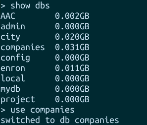
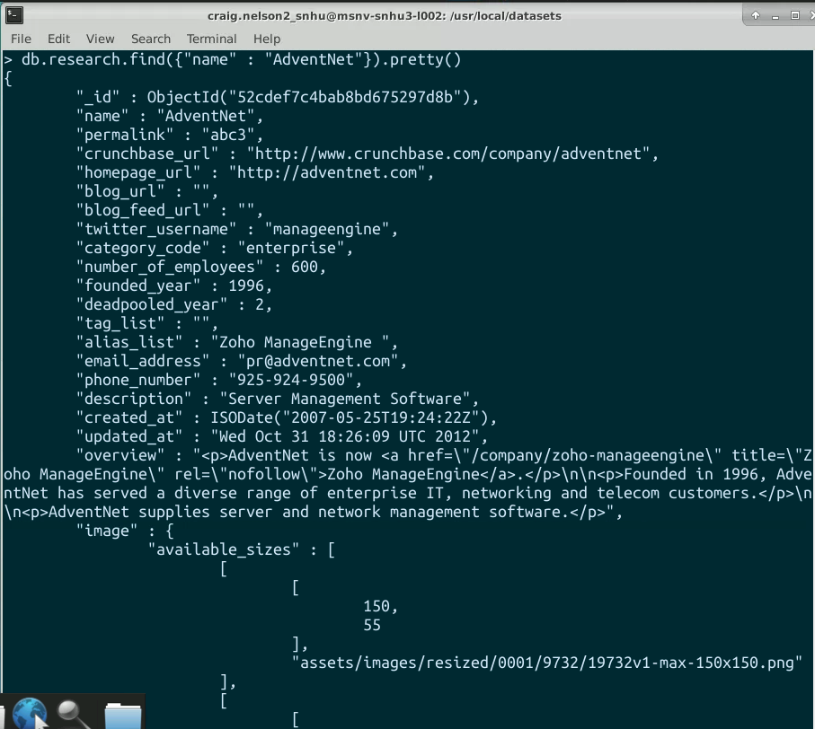
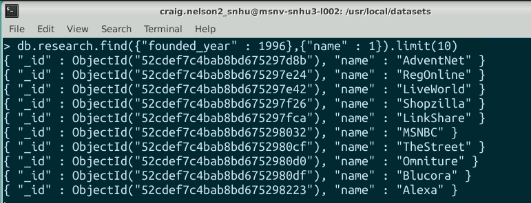

# Data Aggregation Pipeline

We imported the database with:

```mongoimport --port <number> --db=<db name> --collection=<col name> --file=<location and name.json>```  

From the shell, we can see that the database appears.  

>  

# Verify Load  

Next we can run a couple of tests to verify the load.      

```db.research.find({"name" : "AdventNet"})``` 
&nbsp;
-
>

AND.  

```db.research.find({"founded_year" : 1996},{"name" : 1}).limit(10)``` 
&nbsp;
-
>

# Running Queries 

List only the first 20 names of companies founded after the year 2010, ordered alphabetically.


List only the first 20 names of companies with offices in either California or Texas, ordered by the number of employees and sorted largest to smallest.


